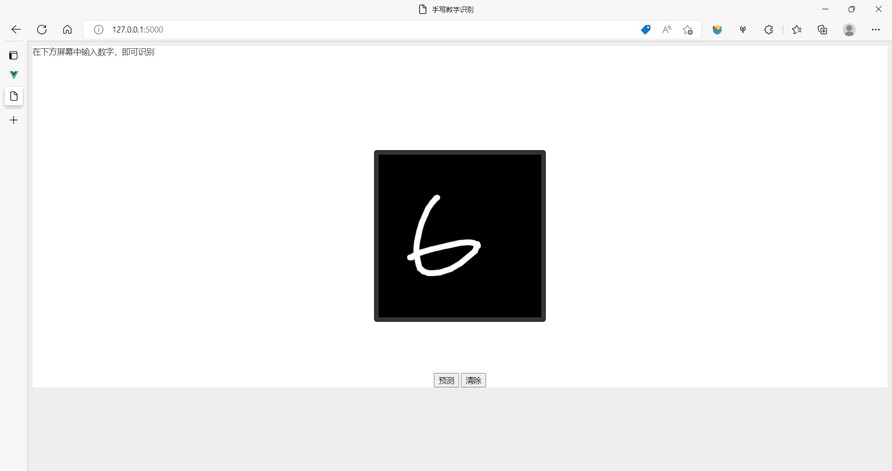

#人机交互大作业 | 运行方式

#### 赵阳

<pr><pr>


**本仓库包含**

报告.pdf：实验报告

drawboard2.0：项目1-画板 

screenshots: 截屏

RecognizeSN_flask：项目2-单个手写数字识别

RecognizeMN：项目3-多数字验证码识别

<-- 进入不同文件夹（如drawboard2.0）即可按照以下1，2，3运行 --> 

<pr><pr><pr>

## 0. 环境


## 1. 项目1-画板

本项目使用vue3+fabric.js

Step 1. 安装依赖

```
npm install
```

Step 2. 运行（热重载）

```
npm run serve
```

Step 3. 查看


<br>

## 2. 项目2-单手写数字识别

本项目使用flask

Step 1. 运行

```
python -m flask run
```

Step 2. 查看



## 3. 项目3-多数字验证码识别

本项目为纯python项目

Step 1. 训练

```
python train.py
```

Step 2. 选一张图片检测结果

以testing文件夹的267221为例

```
python predict.py testing/267221.png
```

Step 3. 查看终端的结果

